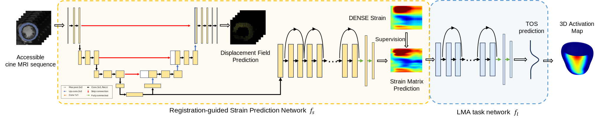

# Multimodal Learning to Improve Cardiac Late Mechanical Activation Detection From Cine MR Images
Official Pytorch Implementation of Paper: [Multimodal Learning to Improve Cardiac Late Mechanical Activation Detection From Cine MR Images](https://arxiv.org/abs/2402.18507)

## Abstract

This paper presents a multimodal deep learning framework that utilizes advanced image techniques to improve the performance of clinical analysis heavily dependent on routinely acquired standard images. More specifically, we develop a joint learning network that for the first time leverages the accuracy and reproducibility of myocardial strains obtained from Displacement Encoding with Stimulated Echo (DENSE) to guide the analysis of cine cardiac magnetic resonance (CMR) imaging in late mechanical activation (LMA) detection. An image registration network is utilized to acquire the knowledge of cardiac motions, an important feature estimator of strain values, from standard cine CMRs. Our framework consists of two major components: (i) a DENSE-supervised strain network leveraging latent motion features learned from a registration network to predict myocardial strains; and (ii) a LMA network taking advantage of the predicted strain for effective LMA detection. Experimental results show that our proposed work substantially improves the performance of strain analysis and LMA detection from cine CMR images, aligning more closely with the achievements of DENSE.

 -->

## Setup
* matplotlib
* torch
* torchvision
* numpy
* lagomorph

To install the lagomorph, please direct to [https://github.com/jacobhinkle/lagomorph](https://github.com/jacobhinkle/lagomorph)

## Data Prepration
The data should be organized within a numpy file that contains a list of python dictionaries. Each dictionary contains the data of one 2D slice, including:
- `cine_lv_myo_masks`: a numpy array with shape `(height, width, n_frames)`, which contains the binary myocardium masks.
- `strain_matrix`: a numpy array with shape `(n_sectors, n_frames)`, which contains the accraute strain matrix from DENSE data and is used as ground-truth.
- `TOS`: a numpy array with shape `(n_sectors, )`, which represents the TOS of the `n_sectors` sectors. By default `n_sectors=126`.
- `subject_id`: a string, which is the ID of the subject.

The npy filename should be specified in the input config json file (default: `configs/config.json`) at `data->npy_filename`.

## Training
```bash
python main.py --training--inference_only=false config-file=configs/config.json
```

## Testing
```bash
python main.py --training--inference_only=true config-file=configs/config.json
```

## References
This code is only for research purposes and non-commercial use only, and we request you to cite our research paper if you use it:
[Multimodal Learning to Improve Cardiac Late Mechanical Activation Detection From Cine MR Images](https://arxiv.org/abs/2402.18507)

```bibtex
@article{xing2024multimodal,
  title={Multimodal Learning To Improve Cardiac Late Mechanical Activation Detection From Cine MR Images},
  author={Xing, Jiarui and Wu, Nian and Bilchick, Kenneth and Epstein, Frederick and Zhang, Miaomiao},
  journal={arXiv preprint arXiv:2402.18507},
  year={2024}
}
```